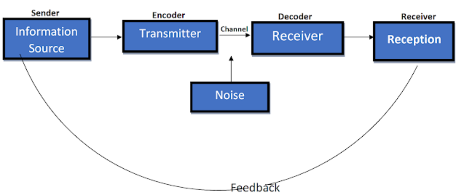

# **Preface** {.unnumbered}

Welcome to this onboarding manual! Please use this manual to facilitate and familiarize yourself with the different aspects of our group as you start your journey with us. This manual will cover the different skills, roles, and responsibilities that is expected of you as a Research Assistant (RA) or a Research Volunteer (RV). This manual will also inform you of the norms and culture of our group, covering aspects from communication etiquette to the schedules of different administrative issues (e.g., meetings, updates), and data/project management (e.g., data wrangling, analyses, data storage).


Themes Credit:

Xie, Y. (2022). bookdown: *Authoring books and technical documents with R Markdown.* Retrieved from <https://bookdown.org/yihui/bookdown/>


<!--chapter:end:index.Rmd-->

# **Introduction**

%any positive looking group photos?%

## Best Practices and Culture

This manual curates different best practices from different resources that aim to improve our organization, management, and productivity for each project. The information is supposed to be general but comprehensive enough for new and existing members to refer to. Therefore, when you are uncertain about certain tasks, do refer to this manual for help as there should be some useful resources available.

You are also encouraged to familiarize yourself on how projects are documented (found here \@ref(folder-structuring)), collaborated, and prepared for presentations and meetings (found here \@ref(meeting-preparations-and-follow-ups)).

## Data Rights and Analyses Procedures

You are recommended to read the **Manual for Data Usage [prof ben do advise if something like this exists?]** which informs the fair usage of databases and datasets that you are given access to. This is important as these data sources are usually copyrighted and there would be usage guidelines which should be noted. Particularly, we should cite these information when we use them in our research.

You are also recommended to read: [Code and Data for the Social Sciences: A Practitioner's Guide](https://web.stanford.edu/~gentzkow/research/CodeAndData.pdf), which is a guide on how to code and to work with data that is referred to by many different research groups. Even if you are totally new to research, this guide should prove useful as it exposes you to the practices on data and coding for the research projects you will take on.

While there are references to different statistical softwares and coding techniques, you shouldn't need to "memorize" them. Instead, you should understand the logic on how and why the codes are annotated or written in certain manner or why certain descriptive statistics are performed first to facilitate the data cleaning process (e.g., min-max for abnormal data or outlier) before the data is analyzed.

## Other Resources

Besides the recommended practices in this group, there will also be several external links to supplement and to inform how other research groups are performing their research. This should expose you to a wider scope of information in a research setting, benefiting your stay with us.

Although there will be some discretion in each person's preferred methods/workflow, we still expect you to read this onboarding manual carefully and to apply the information here as much as possible. If you have suggestions to refine and improve the current structure, we are happy to improve on this manual, with you.

## External Resources:

-   <https://raguide.github.io/> (what is an RA, and what should RAs do?)

-   Please feel free to add any additional resources as needed.

<!--chapter:end:01-introduction.Rmd-->

# **Communication and Etiquette**

Communication is important for knowledge transmission. It is essential to know how to communicate well (and politely) especially in the domain of knowledge development. Besides having the know-hows on data management, being able to communicate your questions and findings to others clearly is equally important. This is why you should take time to craft your emails and other communications carefully.

## Overview

This chapter will cover examples and guidelines for emailing and communicating with me or other colleagues for work purposes. While there is no hierarchy per se, I would appreciate if you understand that most of the communications here are task-oriented rather than for leisure purposes.

Hence, please communicate in a way that demonstrates professionalism. It should be clear that something such as, "5pm, onz?", is overly-casual for a meeting confirmation without much thoughtful content (e.g., location to meet). Instead, something such as, "Hey Ben, would it be okay to having a quick chat at 5pm later on Zoom?" would be much preferred.

## Scheduling

1.  If you are looking to schedule an appointment with me, I would try to respond within 12 hours to acknowledge and to confirm whether I can make it for the stipulated time. If you do not receive anything after 12 hours, then it is likely I have missed your message.

2.  In this case, please send me a reminder. In the event that I also missed the reminder (which rarely happens), please send me a reminder again. I will address them as soon as I can.

3.  Unless otherwise stated, all members should try to respond within 12 hours as well to facilitate the progress in each research projects.

## Email Etiquette

**When drafting an email, Please take note of the following:**

{width="433"}

~[*Shannon\ &\ Weaver\ Model\ of\ Communication*]{.smallcaps}~

1.  *Audience*: Are you addressing it to only me or are those being CC-ed also required to attend to the information? When possible, make it explicit on who should be responding to your emails. Sometimes, individuals who are CC-ed might think that the email is only for information and might not act on them unless stated in the email. Hence, it is helpful to be direct and state what you need from them (e.g., Could Alex provide more information on this dataset?).

2.  *Purpose*: What is the purpose of this email? To inform, to clarify information, to deliver outputs, or to seek resources? Always send an email with context to reduce incorrect interpretation. It is always better to over-describe than to under-describe the context. It also helps to be succinct and clear.

3.  *Attachments:* Please ensure that your attachments are working. You can test this by accessing your link with a separate browser before sending the email. This would reduce the amount of back-and-forth emailing due to dead links.

4.  *Have a Signature:*

    -   Put your name, your title, and link to your website or repo if you have any. This helps to create a professional image as well.

**When responding to emails:**

1.  Use your professional account if possible (e.g., your NUS account).

    -   Since most of the correspondence via email will be work-related, pick one that you check regularly. We want to avoid the situation of, "sorry I didnt check my account XX for a long time as that is my other account". This creates additional hassles to projects.

2.  When possible, respond to your emails even if its simply saying, I acknowledge. This lets the sender know that their emails have been received.

3.  Respond with complete thoughts and with contextual information whenever possible. This will greatly help your receiver understand what you want to convey.

### Email Examples

\% good email example %

\% bad email example %

## Other Text Communications Tools

We might make use of other platforms such as Whatsapp and Slack besides email if its to confirm something simple. Although it is reasonable to be a bit more casual on these platform, it is still important to be respectful and to have some levels of formality.

1.  Slack. In case you are unfamiliar with slack, you can refer to the following links for some ideas on what it is and how to use it.

    -   Our Slack link?

    -   <https://slack.com/help/articles/115004071768-What-is-Slack->

    -   <https://www.getcloudapp.com/blog/what-is-slack/>

    -   <https://www.youtube.com/watch?v=RRxQQxiM7AA>

2.  Whatsapp. Whatsapp should be something that is familiar for everyone. But just in case you are unfamiliar, here are some resources as well.

    -   <https://www.youtube.com/watch?v=fjVlDYu6erU>

    -   <https://www.businessinsider.com/what-is-whatsapp-guide>

3.  Asana

    -   <https://asana.com/guide/videos/new-user-experience>

    -   <https://www.youtube.com/watch?v=uCDftAtr9tI>

    -   <https://www.youtube.com/watch?v=bHaJ4asIlQA>

## External Resources

-   <https://imccart.github.io/phd-workshop-content/etiquette/emails.html#6>

<!--chapter:end:02-communication.Rmd-->

# **Culture and Expectations**

## Professional Rules

Its important that we carry ourselves professionally and three simple rules adopted from [McCarthy, 2020](https://phdworkshop.classes.ianmccarthyecon.com/etiquette/) can help us with that.

1.  **Give others the benefit of the doubt**
    -   Sometimes, interesting coincidences can occur and we should always give others the benefit of doubt, at least for the first few occurrences.
        -   For example, during Covid-19, I had a student whom had to delay his submission for a month because his parents contracted Covid-19 one after another and that resulted in 4 weeks of home quarantine for him!
2.  **Always assume you made the mistake until proven otherwise**
    -   Although it might be easier to point fingers, it is usually more helpful to just assume that the mistake has been made (without assigning blames) and to examine ways to resolve it. Afterall, the end goal is to resolve challenge and making mistakes are a part of this process.
3.  **Respect others' time**
    -   Just as how our time is precious, others' time are equally precious as well. If you have made a commitment to someone for a meeting or a task deadline, always do your best to meet it. If in the midst of performing the task you realize you cannot make it, always ask for an extension as early as you can. More often than not, this will give yourself and others more time to react.

## Culture

<!--# Might need you to complete this prof ben -->

Culture is essentially the shared assumptions, values, and norms that we have as a group. We hope to create a collaborative and supportive culture that allows everyone to voice their opinions easily.

Some work habits/values/practices are:

-   **Treating yourself and others with respect.**

    -   Besides respecting others, voice out whenever you feel that you are getting a disproportionate amount of work or if you cannot cope with your work demands. Being on the assigner's end, sometimes we may not have the full optics, especially with regards to your contextual challenges. So please let us know when you need more time or help.

    -   \<additional values/practices?\>

    -   Here is a list of ex-interns and RAs that have worked with me. Feel free to contact them and ask for a review of how working in this group is like before joining us or deciding what you want to do in this group. <!--# This is what you meant right when you wanted a review group list? -->

-   **Maintain regular contact with your colleagues**

    -   Feel free to say hi when you wish to unwind. Interacting with colleagues are when most interesting research ideas are bounced around!

-   \<any more?\>

## *Expectations*

As a research assistant, intern, or volunteer, there are expectations to be met.

-   **Keeping Organized**

    -   There are often many different steps to take in a research projects, and we do need to rely on you to keep track of your own work progress and occasionally remind us of these intermediary deadlines, to-dos, and submissions deadlines. Hence, you need to be organized to keep abreast of these matters.

-   **Self-driven**

    -   Because much of research is unstructured, we do expect you to be self-driven in wanting to find out more or to ask questions that can help unravel the data better. Since many of us are also usually handling several projects, we do need you to be self-driven in finding answers instead of waiting for us to poke you for updates.

-   **Integrity**

    -   A lot of times, you have the freedom to do a lot of things. This can apply to how much time you work, what you do to the data, and what you want to report. For example, you could selectively extract data for analysis and we wouldnt know unless we redo or rewrite another set of code to check. Hence, we hope that you will perform your task with the highest integrity because the last thing we want is to report findings that are inaccurate.

-   Any more expectations?

## External Resources

-   <https://phdworkshop.classes.ianmccarthyecon.com/etiquette/>
-   <https://raguide.github.io/reqs/>

<!--chapter:end:03-culture-expectations.Rmd-->

# **Meeting Preparations and Follow-ups**

In each meeting, there is likely a large amount of information that you will be transmitting and for you to follow-up on. Therefore, you should bring along something that helps you to note down all these information so you can follow-up on them after the meeting.

Some things to keep in mind for meetings:

1.  **Be punctual and prepared.**

    -   If you are expected to be at the meeting, please be on time and do not keep others waiting unless you have a very good reason. Even so, please inform others that you will be late so other agendas can happen first.

    -   If you are presenting, please come earlier to ensure that all equipment and slide decks are working as per your expectations. There is usually no time to manage technical difficulties and we do not want to prolong meetings unnecessarily.

2.  **Have writing materials with you**

    -   It is likely that you need to do something after the meeting (e.g., send information to others, follow-up on requests). Bring along something to note things down and set deadlines. If someone is consolidating meeting minutes, it might be good to provide these deadline information to people who are relevant to the project so everyone can be on the same page.

3.  **Engage and discuss respectfully**

    -   Speak up (respectfully). In a meeting, it would be good to clarify and to challenge points that may not seem to be reasonable to you. However, please keep things relevant, and if time does not permit, engaging in discussion after meetings with the colleague is also an useful alternative.

4.  **Give attention**

    -   Listen attentively when others are presenting. As much as possible keep off your phones and other stuff on your laptop unless you are writing down relevant points to ask later or for follow-ups.
    -   If this is a 1-1 meeting, you should also not be distracted by other mediums. Moreover, you should give your inputs as we go through the meeting agendas together.

## External Resources

<https://imccart.github.io/phd-workshop-content/etiquette/meetings.html#4>

<!--chapter:end:04.Rmd-->

# **Folder Structuring**

Having the same folder structure across the group is useful because this allows other members to easily find the information that they need. Moreover, having such practices will help you to be more organized as well.

For the data and information, we primarily use these folder headers.

<!--# Prof Ben, I'll leave the folder format to you. Feel free to remove or change as per your current practices -->

## Folder Headers

Here is a breakdown/guide for what information should go into which folder:

-   admin - Information regarding project-related expenses, progress report, and generally anything administrative should come here.

-   analysis - Analysis codes, outputs, and write-ups of those analyses should come here.

-   build - Raw data and data codes for data wrangling of each project should come under here.

-   lit - Literature review, articles, and any relevant reports or information for the project.

-   notes - Meeting minutes, agenda, communications, or other relevant notes can come here.

    -   Note that this should not include any personal notes unless you feel that it is relevant to be shared among the group.

-   paper - Working papers or drafts should come here. Presentations of those papers can also be placed here

-   proposal - Information on proposals for grants, IRBs, or any research proposal and ideas.

-   templates - Templates for report, tables, figures, or any other documents that would benefit from having a report should come here.

    -   Checklists that are used should come here.

## External Resources

-   <https://github.com/gslab-econ/ra-manual/wiki/Data>


<!--chapter:end:05-folder-structuring.Rmd-->

---
output:
  pdf_document: default
  html_document: default
---

# **Coding Know-Hows**

Gaining experience in a research setting will mean dealing with many different datasets. This usually means that you will be wrangling with data and analyzing them in a team, which requires you to code and annotate in a way that others can understand. Often, codes are read more than they are written. That is why it is important to ensure that people can understand and replicate what you've done. Hence, its better to over-annotate than to under-annotate. Never assume that people will understand what you have written. In fact, many people forget what or why they wrote their code in a certain manner after they return to the project from a short month! Therefore, annotate!

As a guide, you may refer to the following resources for coding in the different languages. Primarily, we use R and python, but sometimes, we may also leverage on other tools.

Learning how to write readable and intelligent code will benefit you not only in this group but also in the industry as well. Please refer to the following as a frame of reference.

## *General Guidelines to Code*

## *R Coding Style*

-   <https://bookdown.org/ndphillips/YaRrr/who-is-this-book-for.html>

    -   if this is your first time using R, this is a useful guide for you with regards to installing R, its packages, and loading them.
    -   There are also some examples and tasks useful for getting acquainted with data wrangling. dplyr (part of the tidyverse package) is the go-to for many R users.

-   [Tidyverse style guide](https://style.tidyverse.org/)

    -   While there are many different R coding styles, the tidyverse guide is one that is widely used.
    -   Annotate as much as you can, the top of the script should tell what the scripts ideally do (i.e., no errors encountered when executed), and whenever possible, explain why certain steps or packages are called.

### R Packages

There are some packages which we recommend you to at least have in your R. You can simply install them by typing,


```r
## install.package("packagename")
```

-   tidyverse (for data wrangling)

    -   ggplot2, dplyr, stringr, texreg, lubridate are some of the powerful packages inside

-   foreign or rio (for importing and export data)

-   psych (useful for getting descriptive statistics such as mean, sd)

## *Python Coding Style*

-   <https://about.gitlab.com/blog/2021/10/21/beginner-guide-python-programming/>

    -   If this is your first time using python, gitlab has a good guide on installing and the basics of python.

    -   Please note that python is release in two version, Python 2 and Python 3. Generally, most people are using Python 3 and Python 2 are only used when there are compatibility issues to consider.

-   <https://learnpythonthehardway.org/python3/>

    -   There are many resources online for learning python. Here is one of them, however, you do not need to refer to this and you can always use something or learn from something that you prefer.

-   Once you get the hang of it, you may move on to choose different IDEs that you prefer. Some of the popular ones include, Visual Code Studio, Jupyter Notebook, PyCharm.

-   <https://docs.python-guide.org/> & <https://google.github.io/styleguide/pyguide.html>

    -   While there are many different python coding styles as well, here are some you can refer to as a guide.

### Python Packages

There are some packages which we recommend you to at least have in python by typing in command line.

In the command prompt, you could type:


```r
## python -m pip install pandas
```

-   pandas, numpy: Both are good for data wrangling and data manipulation

-   matplotlib, seaborn, and ggplot: These are good for data visualization.

## Any other languages used?

## External Resources

-   <https://github.com/gslab-econ/ra-manual/wiki/Python>
-   <https://github.com/gslab-econ/ra-manual/wiki/R>

<!--chapter:end:06-coding.Rmd-->

# **Literature Review**

Before performing any research, we need to ask, what are people interested in or what is a gap in the current research? A good way to know this is to read the [**research literature**]{.underline} and [**current news**]{.underline}, which can motivate research questions and guide findings that are valuable for adding knowledge or solving problems in the field.

<!--# Prof Ben could you improve on this as to how your group approaches setting a research direction or question? -->

## Search Engines

Regardless which institutions you are from, you should have access to search engines that are build specifically for finding literature and other academic resources.

While there are many different search engines for data and information, here are some that would be helpful to start your search on.

-   [Google Scholar](https://scholar.google.com/)
-   Web of Science
-   Scopus
-   SSRN
-   Proquest

## Recommended Journals

Here are a list of journals which are worth deep-diving into to understand topics and questions that are asked in this group:

-   

<!--# Again, I would need your expertise here Prof Ben. -->

## Recommended News Sources

<!--# Again, I would need your expertise here Prof Ben. -->

## External Resources

<!--chapter:end:07-lit-review.Rmd-->

# **Data Analyses and Visualization**

Before running any analyses (e.g., regressions), we need to ensure that the data we have is cleaned and free from any errors to our best abilities.

Importantly, we should never work directly on the master file. We should always clean the data using a copied set so that we do not lose the original data if we accidentally overwrite something. Hence, always create a copy and work on that copy instead of the raw master data.

## *Checklist for Data Wrangling* <!--# Feel free to change the points, or to link to a checklist you might already have. -->

1.  Check descriptive statistics for any abnormalities.
    -   Some common errors:

        -   Missing data

        -   Data that is not in range for variable (e.g., -10 for age)

        -   Outliers

        -   Unreadable data or incomplete reading of data
2.  Plot histograms, time series plot, or any other plots that are helpful to "eyeball" for weird occurrences or unexpected patterns.
3.  Check that your data fits the properties required for running the required analytic tests.
    -   e.g., If your outcome variable is binary, then maybe consider running logistic regression over a linear regression.

## *Checklist for Analysis*

If your data has been properly cleaned, you can move on to determine what analysis technique would be helpful for answering your research question.

1.  Examine what analysis techniques should be used and if your data allows the analysis to be performed.
    -   Some common techniques:

        -   Regressions

        -   ANOVA

        -   Multi-level modelling

        -   <!--# Not sure what is mainly used -->
2.  Consider if there is a need to control any variables in your analyses.
    -   Commonly controlled factors could be gender, age etc.
    -   You may also have other relevant variables that should be controlled for in the analyses based on your research questions.
3.  Interpret your outputs and what does it mean in relation to the research question? For example, what does it mean when you have a negative regression coefficient?

## *Checklist for data visualization*

Finally, when you are satisfied with your analyses, create visually appealing plots with R or python. For both softwares, there are many packages out there which helps you to perform these ( see \@ref(general-guidelines-to-code) for some packages).

When we are preparing for publication, we might use LaTeX for plotting. LaTeX is helpful because there are existing templates that are used for publications. For example, [AEA](https://www.aeaweb.org/journals/aej/styleguide) has templates for publications and table/figure formatting. One popular LaTeX tool is Overleaf: <!--# NUS has free premium Overleaf, but not sure for the rest? -->

-   You should always export your visualizations in a high quality format such as EPS or PDF. To allow others to reproduce your visualization, you should specify as many details (e.g., size, resolution) as possible.

## External Resources

-   Data Visualization

    -   <https://www.jstor.org/stable/43193723?seq=8#page_scan_tab_contents>

-   Latex:

    -   <https://www.overleaf.com/learn/latex/Learn_LaTeX_in_30_minutes>

    -   <https://github.com/naecker-lab/lab-manual/wiki/LaTeX>

<!--chapter:end:08-data-analysis-visualization.Rmd-->

# **Misc Important Information**

## **Tools**

Over at our group, we have a few other communication tools besides the usual emails and zoom.

1.  [#Placeholder]

2.  [#Placeholder]


## **Frequently Asked Questions**

Here are also FAQs that you may have:

1. How do I get paid if I am a paid RA?

<!--chapter:end:99-add-info.Rmd-->

